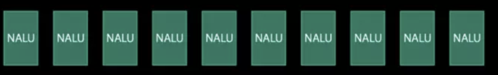
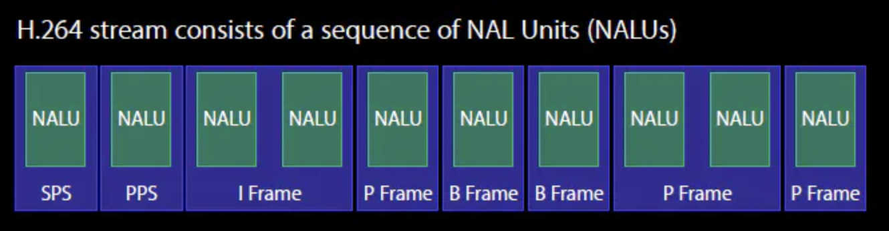

*本文基于H.264（AVC）编码协议下进行的讲解*

- 视频原理

  - `YUV`图片：本质上就是图标一帧一帧播放的过程，与我们平时接触的 JPE、PNG的图片是一样的。但是为了效率原因，视频中解码出来的图片帧叫YUV
  - `PCM`音频：通常由`MP3`或者`AAC`等格式的音频二进制中，解码出来的音频采样点。可以理解为一片`PCM`音频等于一个声音单位
  - 音视频同步：在计算机渲染到图层的同时，根据`DTS`、`PTS`来同步播放音频帧（DTS、PTS后续介绍）

- I、P、B帧介绍

  在实际中，我们并不会把每一帧完整的图片进行传输，因为这样会导致视频的体积很大，对数据的存储和网络传输来说都代价很大。因而，通常会对视频的部分画面进行压缩（编码）处理。根据压缩处理方式不同，画面帧就分为I 帧、P帧、B帧

  - I 帧：I 帧图像采用帧内编码方式，即只利用了单帧图像内的空间相关性，而没有利用时间相关性。I 帧使用帧内压缩，不使用运动补偿，由于 I 帧不依赖其它帧，所以是随机存取的入点，同时是解码的 `基准帧`。I 帧主要用于接收机的初始化和信道的获取，以及节目的切换和插入，I 帧图像的压缩倍数相对较低。I 帧图像是周期性出现在图像序列中的，出现频率可由编码器选择。
  - P帧：P 帧和 B 帧图像采用帧间编码方式，即同时利用了空间和时间上的相关性。P 帧图像只采用前向时间预测，可以提高压缩效率和图像质量。P 帧图像中可以包含帧内编码的部分，即 P 帧中的每一个宏块可以是前向预测，也可以是帧内编码。
  - B帧：B 帧图像采用双向时间预测，可以大大提高压缩倍数。值得注意的是，由于 B 帧图像采用了未来帧作为参考，因此 MPEG-2 编码码流中图像帧的传输顺序和显示顺序是不同的。

  也就是说，I 帧可以不依赖其他帧就可以解码出一个完整的图像，而P帧、B帧不行。P 帧需要依赖视频流中排在P帧前的帧才能解码出图像。而B帧则需要依赖视频流中排在它前面或者后面的帧才能解码出图像

  Q：这里就会有一个问题，既然这样，在视频流中，先到的B帧无法立即解码，需要依赖它后面的I 、P帧先解码完成，这样一来播放时间和顺序就不一致了，顺序被打乱，那么该如何播放？这里引申出来2个东西： `DTS` 、 `PTS`

- DTS、PTS

  - DTS（Decoding Time Stamp）：即解码时间戳，这个时间戳的意义在于告诉播放器该在什么时候解码这一帧的数据。
  - PTS（Presentation Time Stamp）：即显示时间戳，这个时间戳用来告诉播放器该在什么时候显示这一帧的数据。

  现在来解释之前提到的问题：

  假设某一段视频流的显示顺序是 `I B B P`

  那个在视频流中的顺序可能是 `I P B B`

  DTS告诉我们应按什么顺序解码这几帧的视频。PTS告诉我们该按什么顺序显示这几帧视频

  顺序如下所示

  ```js
  	PTS: 1 4 2 3
  	DTS: 1 2 3 4
  Strem: I P B B
  --------------->
  ```

- 与视频体积相关的参数

  `码率（比特率）` `帧数` `分辨率`

  - 码率（比特率）：指单位时间内传输数据位数，一般用kbps即千位每秒。可以理解为采样率。单位时间内采样率越大，精度越高，越接近原始文件。

    ```json
    kbps = 文件大小(M) * 1024 * 1024 * 8 / 视频时长(s)
    如：800kbps代表每秒产生 100KB的数据
    ```

  - 分辨率：指单位英寸中所包含的像素点数。如：1280 x 720  俗称720P

  - 帧率：指GPU在1s内刷新几次，用`fps`表示

  

  Q：当我们知道了视频的这些数据之后，我们可以用来干嘛呢？

  A1：计算视频大小

  ```json
  视频时间 x 码率（kbps）/  8  =  视频文件大小
  ```

  A2：视频压缩

  ```json
  已知原视频100M，视频时长为3分钟，产品要求最大上传视频不超过10M
  按照系统实现无法达到这个压缩率，因此需要调整对应的码率或者调整视频的编码格式。mkv -> H.26X
  MaxVideoBitRate = 10 * 1024 * 1024 * 8 / 180 = 466033.777777778bps ≈ 46.6kbps
  因而需要把视频解码出来后，再按照特定的比特率，进行再次编码
  这样输出出来的才是符合要求的视频
  ```

  A3：计算最大同时在线人数or当前带宽下最大能支撑的同时在线人数

  ```json
  已知一个视频文件大小为5M，播放时长为3分钟
  VideoRate = 5 * 1024 * 1024 * 8 / 180 = 233016.888888889bps
  10M独享宽带能支撑的同时在线人数
  MaxOnLinePeople = 10 * 1024 * 1024 / VideoRate = 45人
  支撑1000人同时在线的系统最少带宽
  MinBandwidth = VideoRate * 1000 / (1024 * 1024) = 222.222222222M
  
  所以在直播行业，带宽决定整个体验的重要因素
  ```

- 编码方法

  `硬编码` `软编码` 

  硬编码：不使用CPU进行编码，使用显卡GPU,专用的DSP、FPGA、ASIC芯片等硬件进行编码

  优缺点：性能高，低码率下通常质量低于软编码器，但部分产品在GPU硬件平台移植了优秀的软编码算法（如X264）的，质量基本等同于软编码

  

  软编码：使用CPU进行编码

  优缺点：简单、直接、易用，但是CPU负载很高，性能较低，低码率下质量通常比硬编码要好一点。

  

  软编码算法：H.264

  ```js
  H.264是新一代的编码标准，以高压缩高质量和支持多种网络的流媒体传输著称，超越了很多商用的压缩器
  ```

  基本介绍（了解）：

  ```js
  参照一段时间内图像的统计结果表明，在相邻几幅图像画面中，一般有差别的像素只有10%以内的点,亮度差值变化不超过2%，而色度差值的变化只有1%以内。
  所以对于一段变化不大图像画面，我们可以先编码出一个完整的图像帧A，随后的B帧就不编码全部图像，只写入与A帧的差别，这样B帧的大小就只有完整帧的1/10或更小！B帧之后的C帧如果变化不大，我们可以继续以参考B的方式编码C帧，这样循环下去。这段图像我们称为一个序列（序列就是有相同特点的一段数据，GOP），
  当某个图像与之前的图像变化很大，无法参考前面的帧来生成，那我们就结束上一个序列，开始下一段序列，也就是对这个图像生成一个完整帧A1，随后的图像就参考A1生成，只写入与A1的差别内容。
  ```

  

  算法说明

  - 序列（GOP）：在H264中图像以序列为单位进行组织，一个序列是一段图像编码后的数据流，以I帧开始，到下一个I帧结束。在序列中，第一个图像叫做 IDR 图像（立即刷新图像），IDR 图像都是 I 帧图像，

  

  H.264原始码流（又称为裸流）是由一个个`NALU（NAL Unit）`组成的，其结构如下图所示

  

  每个`NALU`之间由startcode（起始码）进行分隔，起始码分为两种：0x000001（3Byte）或者0x00000001（4Byte）

  

  在解码H.264的时候，首先就需要先从码流中搜索`0x000001`和`0x00000001`，分离出NALU；然后再对每个NALU进行解析

  每个NALU包含：

  1. 视频帧

  

  2. H.264属性集合

     这个集合包含SPS（Sequence Parameter Set）和PPS（Picture Parameter Set），这里可以简单理解为H.264的编解码参数，用于创建解码器。

  3. NALU header（startcode）

     由三部分组成，forbidden_bit(1bit(禁止位))，nal_reference_bit(2bits)（优先级），nal_unit_type(5bits)（类型）

     nal_unit_type：表示当前NALU的类型

     

  

  下图展示了一个完整的H.264码流结构

  

  Q：到这里，我们可以大致了解H.264协议，那么我们可以做什么？

  A：从`nal_unit_type`的类型表格中我们可以观察到，nal_unit_type=6的时候，有一个补充增强信息单元（SEI），这个地方我们可以写入一个`16字节`的信息。可以作为当前视频的关键字，可当做防伪字段。但是并不安全，因为任意视频解码器都能把这个信息解码出来并加以利用。

  

- 硬编码

  根据不同平台的API不相同，原则是无脑往API丢如YUV图像，输出编码好的H.264

  


#### 参考文章

[iOS硬编解码相关知识](https://www.jianshu.com/p/5d555aa55ea1)

[(推荐阅读)H264, H265硬件编解码基础及码流分析](https://juejin.im/post/5ce9f36bf265da1bbd4b5084)

#### 延展阅读

[[总结]视音频编解码技术零基础学习方法](https://blog.csdn.net/leixiaohua1020/article/details/18893769)

[iOS-FFmpeg集成](https://juejin.im/post/5a3348355188257dcc2faad4)

[H264码流中SPS PPS详解](https://zhuanlan.zhihu.com/p/27896239)

[SEI的那些事](https://www.jianshu.com/p/4d9120dfcd69)